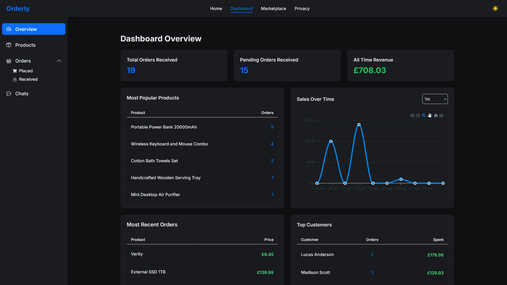
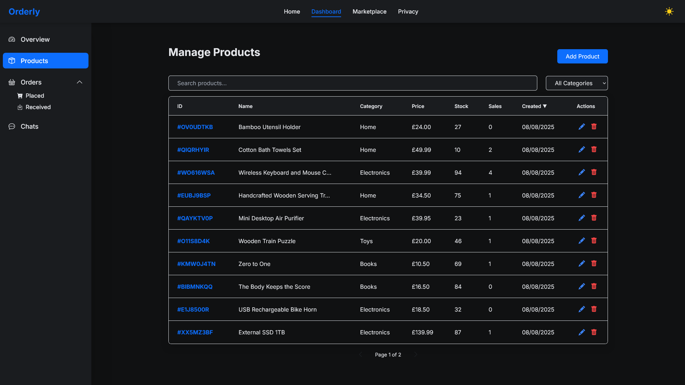
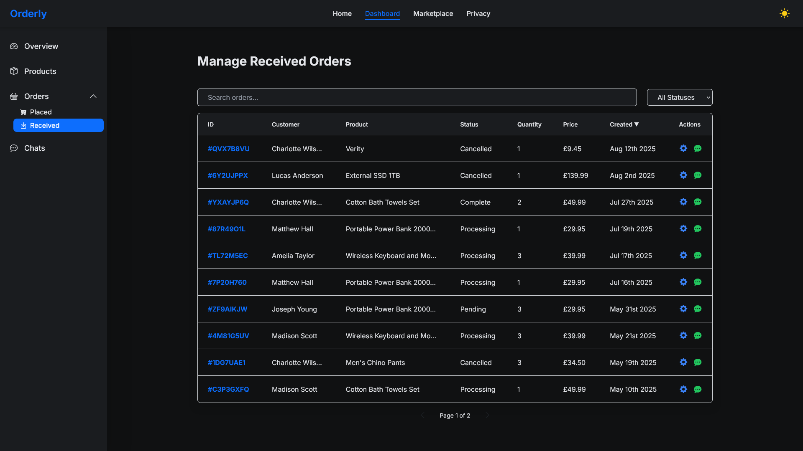
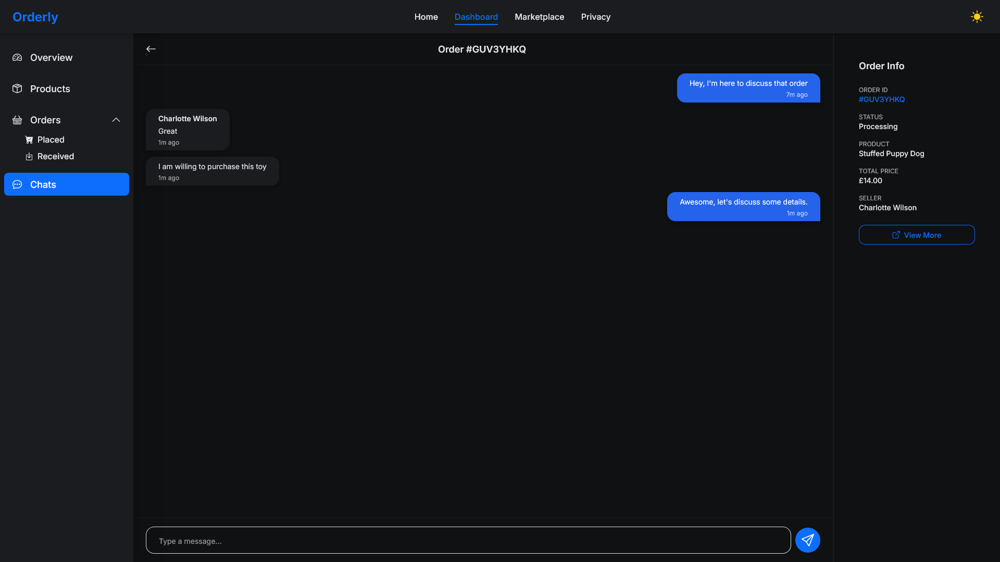

# 🚀 Orderly — Full-Stack Blazor WebAssembly Marketplace

[](LICENSE)  

---

Orderly is a **modern full-stack marketplace web application** built with **Blazor WebAssembly**, **ASP.NET Core Web API**, **SignalR real-time communication**, and a **MySQL database** using Entity Framework Core.

This portfolio project demonstrates a rich user experience with product management, order processing, analytics, and real-time chat — all wrapped in a sleek, responsive UI.

---

## ✨ Key Features

- **Dashboard Overview:** Real-time analytics and key metrics at a glance  
- **Product Management:** Create, edit, and delete your marketplace listings
- **Order Management:** Track and manage orders seamlessly  
- **Real-Time Chat:** Communicate with users instantly in real time
- **Responsive Design:** Fully functional and polished on both desktop and mobile

---

## 🛠️ Tech Stack

### Frontend
- **Blazor WebAssembly** (.NET 8) — SPA with client-side C# and JavaScript
- **Bootstrap 5** — Responsive, mobile-friendly UI design
- **SignalR Client** — Real-time instant updates so the user never has to refresh their browser

### Backend
- **ASP.NET Core Web API** — RESTful services with C# and .NET 8  
- **SignalR Server** — Real-time messaging and event signalling backend
- **Entity Framework Core** — Code-first MySQL database access and migrations

### Database
- **MySQL** — Relational database design and optimization

### DevOps & Tools
- **Git & GitHub** — Source control and version management  
- **Visual Studio** — Development and debugging IDE

---

## 🖼️ Screenshots

### Dashboard Analytics Overview  
Get a snapshot of your marketplace’s health with real-time analytics and key performance indicators displayed clearly for quick decision-making.



---

### Products Management  
Easily create, edit, and organize your product listings with a clean and intuitive interface built for efficiency.



---

### Received Orders  
Track and manage incoming orders seamlessly, with detailed order info to keep your marketplace running smoothly.



---

### Real-Time Chat  
Engage in instant communication with other users via the integrated SignalR-powered chat system.



### Public Marketplace
Browse a catalogue of publicly created products, place orders and manage them within your dashboard.


---

## 🚀 Getting Started

### Prerequisites

- [.NET 8 SDK](https://dotnet.microsoft.com/download)  
- [MySQL Server](https://dev.mysql.com/downloads/mysql/) or Docker equivalent  

### Setup Instructions

```bash
git clone https://github.com/bytezera/orderly.git
cd orderly
```
